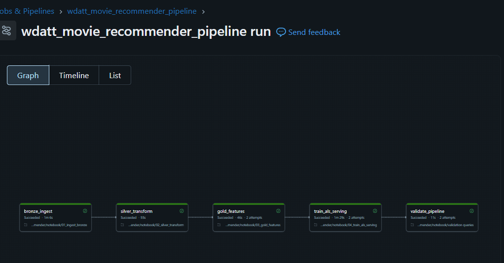
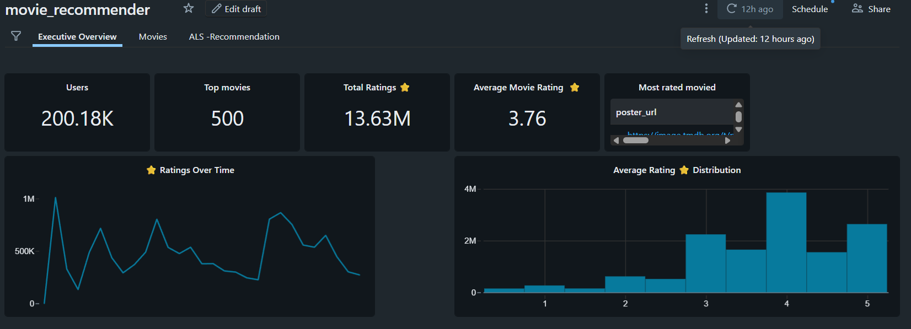

# 🎬 Movie Recommender Lakehouse

## 📌 Executive Summary

This project simulates the work of a **Data Engineer at a streaming platform** building a production-ready recommendation system using a Lakehouse architecture on Databricks.

The system:

- Processes 13M+ movie ratings
- Integrates structured and semi-structured data
- Implements a Medallion architecture (Bronze → Silver → Gold)
- Trains an ALS collaborative filtering model
- Produces a serving-ready Top-10 recommendation table per user
- Powers executive dashboards for analytics

The goal is to demonstrate scalable data engineering, dimensional modeling, and ML-to-serving integration in a unified lakehouse system.

# 🏗 Architecture

This project follows the **Medallion Architecture** to ensure data quality and scalability at every stage.
```
Raw CSV + JSON
↓
Bronze (Raw Delta Tables)
↓
Silver (Cleaned & Joined Data)
↓
Gold (Star Schema + ML Features)
↓
Serving (Top-10 Recommendations per User)
```

## Layer Breakdown

### 🔹 Bronze (Raw)
Landing zone for:
- ratings.csv
- movies.csv
- links.csv
- tags.csv
- scraped_metadata.json

No transformations applied — data is stored as-is in Delta format.

---

### 🔹 Silver (Cleaned & Modeled)
Responsibilities:
- Schema enforcement
- Type casting
- Handling nulls and dirty records
- Parsing genres into `ArrayType`
- Joining MovieLens data with scraped metadata

---

### 🔹 Gold (Business & ML Ready)

Star schema modeling:

**Fact Table**
- `gold_fact_ratings`

**Dimension Tables**
- `gold_dim_movies_enriched`
- `gold_dim_users`

Features engineered:
- Power user identification
- Clean dimensional modeling
- ML training dataset preparation

### 🔹 Serving Layer

- ALS model trained using Spark MLlib
- Top-10 recommendations generated per user
- Predictions enriched with movie metadata
# 📦 Data Sources

| Dataset | Source | Format | Engineering Challenge |
|----------|--------|--------|-----------------------|
| Ratings | MovieLens | CSV | High-volume processing (13M+ rows) |
| Movies | MovieLens | CSV | Genre parsing & normalization |
| Links | MovieLens | CSV | Cross-referencing IDs |
| Enrichment | Web Scraped | JSON | Handling semi-structured schema |

The project integrates structured CSV data with externally scraped JSON metadata to simulate real-world fragmented data systems.

# 🤖 Machine Learning

Model used: **ALS (Alternating Least Squares)**  
Library: `pyspark.ml`

The model is trained on the Gold fact table using collaborative filtering to learn latent user-item preferences.

Key design decisions:

- Cold start handled using `coldStartStrategy="drop"`
- Training performed on clean, typed Gold data
- Recommendations generated in batch
- Top-10 results precomputed and stored

This ensures low-latency serving without runtime model inference.
# 📊 Workflow & dashboard

<div align="center">

<table>
<tr>
<td align="center">

###  🔁 End-to-End Workflow   


</td>
<td align="center">

### 📊 Analytics Dashboard 


</td>
</tr>
</table>

</div>
Built using Databricks SQL dashboards powered by the Gold layer.

## Executive Overview
- Total Ratings
- Total Users
- Total Movies
- Global Average Rating

## Movies Performance
- Top 10 Movies by Engagement
- Director Performance
- Genre Distribution
- Budget vs Rating Analysis

## Serving Example

```sql
SELECT *
FROM workspace.default.wdatt_movie_serving_user_recommendations_enriched
WHERE userId = 123
ORDER BY rec_rank;
```
This query retrieves ranked, enriched recommendations for a specific user.
# ⚙️ Installation & Usage

1. Clone the repository.
2. Import notebooks into a Databricks Repo.
3. Upload datasets to a Unity Catalog Volume.
4. Run notebooks sequentially:

   1. `01_ingest_bronze.ipynb`
   2. `02_silver_transform.ipynb`
   3. `03_gold_features.ipynb`
   4. `04_train_als_serving.ipynb`

Alternatively, execute via a Databricks Workflow for full automation.
# 🚀 Engineering Highlights

- Medallion Architecture implementation
- Star schema modeling (Fact + Dimensions)
- Integration of structured and semi-structured data
- Large-scale aggregation on 13M+ ratings
- Batch ML training with Spark ALS
- Precomputed serving layer for low-latency recommendations
- End-to-end workflow orchestration
- 
  # ✅ Validation

A final notebook (`validation queries.ipynb`) runs end-to-end sanity checks to ensure the pipeline produced correct outputs.

It verifies:
- All Bronze/Silver/Gold/Serving tables exist and are non-empty
- `gold_dim_movies_enriched` contains exactly **500 movies**
- Serving recommendations have valid ranking (`rec_rank` ∈ [1, 10])

Example logic:

- Count row totals per table
- Assert expected counts where applicable
- Validate recommendation ranks are within bounds

This project was developed as part of the **AI & Data Science Bootcamp**, specializing in **Data Engineering**, at **`</becode>`**.

**Authors:**  
- Welederufeal Tadege [LinkedIn](https://www.linkedin.com/in/) | [Github](https://github.com/welde2001-bot)
- Pierrick Van Hoecke [LinkedIn](https://www.linkedin.com/in/pierrick-van-hoecke/) | [Github](https://github.com/pierrickvhk)
- Frederic Delville [Github](https://github.com/Fred-git121)

